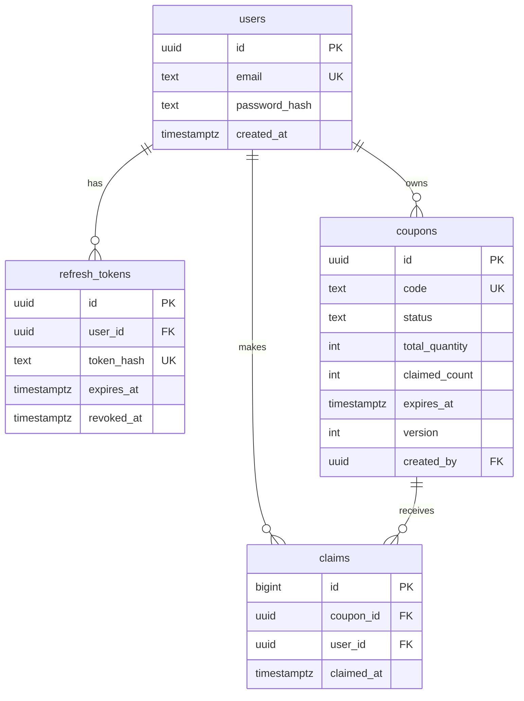
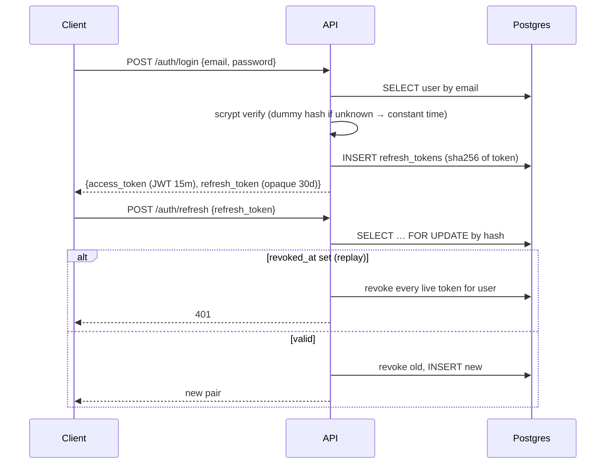
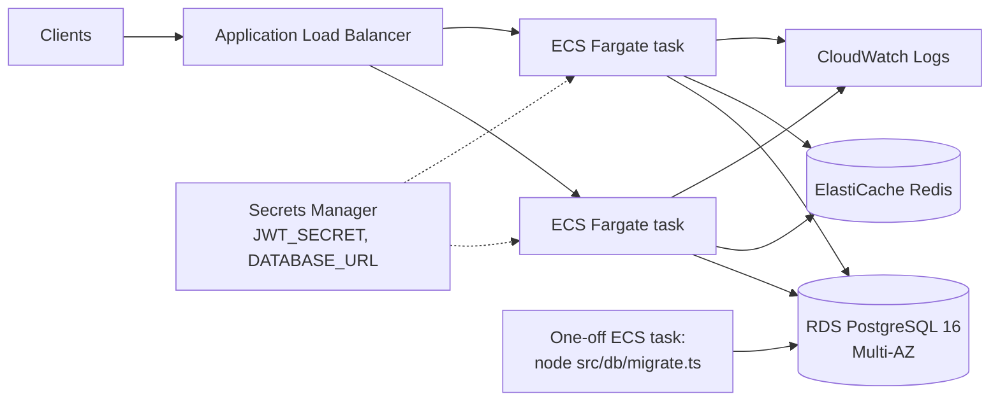

# Luarc Asset Management API

A coupon/voucher pool where authenticated users claim limited units, built so that the system stays
**exactly** consistent when hundreds of users race for the same coupon or edit the same record.

- **Consistency-first.** Every rule is enforced by Postgres (UNIQUE, CHECK, row locks), not by
  application code that hopes nobody races it. The claim path is two SQL statements and zero explicit locks.
- **Proven, not asserted.** The test suite fires 500 concurrent claims at 50 units and checks that exactly 50
  land and the counter equals the row count. A k6 script does the same over real HTTP.
- **Secure auth.** scrypt passwords, short-lived HS256 JWTs, rotating refresh tokens with reuse detection.
- **Boring where it should be.** Express 5, Kysely, zod, pino, one Docker Compose file, GitHub Actions.

## Quick start

Prerequisites: Docker (Compose v2 or v1), Node 24 for local dev outside the container, `jq` for the curl walkthrough below.

```bash
docker compose up -d --build        # Postgres 16 + Redis 7 + API; runs migrations and seed
open http://localhost:3000/docs     # Swagger UI
```

`docker-compose` (v1, hyphenated) works identically if that is what you have installed.

Walk the whole flow with curl:

```bash
# 1. Log in as the seeded demo user
TOKEN=$(curl -s -X POST localhost:3000/auth/login -H 'content-type: application/json' \
  -d '{"email":"demo@luarc.test","password":"demo-password-123"}' | jq -r .access_token)

# 2. See the global pool (RACE-50 has 50 units)
curl -s 'localhost:3000/coupons?available=true' -H "authorization: Bearer $TOKEN" | jq '.data[] | {code, remaining, claimed_by_me}'

# 3. Claim one
ID=$(curl -s 'localhost:3000/coupons?q=RACE-50' -H "authorization: Bearer $TOKEN" | jq -r '.data[0].id')
curl -s -X POST localhost:3000/coupons/$ID/claims -H "authorization: Bearer $TOKEN" | jq

# 4. Claim again → 409 already-claimed (safe to retry, nothing changes)
curl -s -X POST localhost:3000/coupons/$ID/claims -H "authorization: Bearer $TOKEN" | jq

# 5. Your history and the pool stats
curl -s localhost:3000/me/claims -H "authorization: Bearer $TOKEN" | jq
curl -si localhost:3000/coupons/stats -H "authorization: Bearer $TOKEN" | grep -iE 'x-cache|claimed_units|total_claims'
```

Local development without the API container:

```bash
docker compose up -d postgres redis
cp .env.example .env
npm ci && npm run migrate && npm run seed
npm run dev                          # http://localhost:3000
npm test                             # real Postgres + Redis, no mocks
```

## API overview

| Method | Path | Auth | What it does |
|---|---|---|---|
| POST | /auth/register | – | Create account, receive token pair |
| POST | /auth/login | – | Credentials → token pair (identical 401 for unknown email / wrong password) |
| POST | /auth/refresh | – | Rotate refresh token; replay of a rotated token revokes the whole family |
| POST | /auth/logout | – | Revoke a refresh token |
| GET | /me | Bearer | Current user |
| GET | /me/claims | Bearer | **Your history**: your claims joined with their coupons, filters `from`/`to`/`coupon_status`, keyset pagination |
| POST | /coupons | Bearer | Create a coupon (you become its owner) |
| GET | /coupons | Bearer | **Global pool**: every coupon with `remaining` and `claimed_by_me`, filters `status`/`available`/`q` |
| GET | /coupons/stats | Bearer | Aggregate totals, cached 5s in Redis, invalidated on every write |
| GET | /coupons/{id} | Bearer | One coupon |
| PATCH | /coupons/{id} | Bearer, owner | Edit with optimistic locking (`version` in body) |
| POST | /coupons/{id}/claims | Bearer | **Claim one unit** — the concurrency-critical path |
| GET | /health | – | Postgres and Redis checks |

Full contract: [`openapi.yaml`](openapi.yaml), served at `/docs`. A test asserts every registered route is documented.

Errors are [RFC 9457](https://www.rfc-editor.org/rfc/rfc9457) problem details. Problem types:
`validation-error`, `invalid-json`, `payload-too-large`, `unauthorized`, `forbidden`, `not-found`, `email-taken`,
`invalid-credentials`, `invalid-refresh-token`, `code-taken`, `already-claimed`, `coupon-sold-out`, `coupon-expired`,
`coupon-disabled`, `version-conflict`, `quantity-below-claimed`, `unknown-user`, `rate-limited`, `lock-timeout`,
`statement-timeout`, `internal`.
Every error carries the `request_id` that also appears in the structured logs.

## Data model



Rules, all enforced by the database:

1. `0 <= claimed_count <= total_quantity` — `CHECK coupons_claimed_within_total`. The oversell backstop.
2. One claim per (coupon, user) — `UNIQUE claims_coupon_id_user_id_key`.
3. `claimed_count = COUNT(claims)` for every coupon — maintained by the claim transaction below and made
   observable by `/coupons/stats`, which returns both numbers.

`remaining` is derived (`total_quantity - claimed_count`), never stored, so it cannot drift. "Sold out" is
`remaining = 0`, not a status flag.

## Consistency design

### Claiming: insert, then conditional update

```sql
BEGIN;  -- READ COMMITTED

-- 1. Uniqueness gate. A duplicate dies here on the unique index without touching the hot row.
INSERT INTO claims (coupon_id, user_id) VALUES ($coupon, $user);

-- 2. Compare-and-swap. Postgres takes the row lock inside the UPDATE and re-evaluates the WHERE
--    against the newest committed row once any concurrent writer finishes.
UPDATE coupons
   SET claimed_count = claimed_count + 1, updated_at = now()
 WHERE id = $coupon
   AND status = 'active'
   AND (expires_at IS NULL OR expires_at > now())
   AND claimed_count < total_quantity
RETURNING claimed_count, total_quantity;
-- 0 rows → read the row to say why (sold out / expired / disabled) → ROLLBACK undoes the INSERT.

COMMIT;
```

Source: [`src/coupons/service.ts`](src/coupons/service.ts) (`claimCoupon`).

| Alternative | Why not |
|---|---|
| `SELECT … FOR UPDATE`, check in app, `UPDATE` | Correct, but two round trips and the check lives in JavaScript. The conditional `UPDATE` takes the same lock with the check in SQL. |
| `SERIALIZABLE` + retry loop | Correct, but forces retries exactly when traffic is heaviest — the opposite of what we want. Overkill when one row is the entire conflict. |
| Redis / in-process mutex | Not durable, not transactional, wrong layer. The database already owns the row lock. |
| Read count, then blind `UPDATE SET claimed_count = $n` | Lost update. This is the bug the exercise is about. |

**Why this is safe without a stricter isolation level.** The condition is re-checked after the row lock is
acquired, so two transactions can never both see `claimed_count < total_quantity` and both increment past it.
The unique index does the same job for duplicates: the second insert waits for the first to finish, then fails.

**Deadlock freedom.** Every claim touches its own new `claims` row, then one `coupons` row, always in that order.
The foreign-key check takes a `FOR KEY SHARE` lock on the coupon row; the `UPDATE` of non-key columns takes
`FOR NO KEY UPDATE` — two Postgres lock types that are allowed to coexist. Concurrent claims on one coupon
simply wait their turn for the row, one after another.

**Idempotent retries.** A client that times out and retries gets 409 `already-claimed`, and nothing changes.

### Editing: optimistic locking with an explicit version

`PATCH /coupons/{id}` requires the `version` the client last read. The update is a single statement:

```sql
UPDATE coupons SET …, version = version + 1
 WHERE id = $id AND created_by = $me AND version = $expected
```

Zero rows means not found, not owner, or stale — the service re-reads to tell you which (404 / 403 / 409 with
`current_version`). Shrinking `total_quantity` below `claimed_count` is refused by the CHECK constraint → 422.

**Why not ETag / If-Match?** That's the standard HTTP way to do this, and it was the first draft. It was dropped
because a correct ETag has to change whenever the response body changes, and `claimed_count` changes on every claim.
An editor of a busy coupon would get 412 in a loop and never land an edit. `version` increments only on edits, so
edits and claims are independent: they touch separate columns under the same row lock, and the CHECK constraint
resolves the one place they can still conflict.

## Concurrency proof

`npm test` runs [`test/concurrency.test.ts`](test/concurrency.test.ts) against a real Postgres:

| Scenario | Expectation |
|---|---|
| 500 users race for 50 units | exactly 50 × 201, 450 × 410, `claimed_count = COUNT(claims) = 50`, 50 distinct winners |
| One user fires 100 parallel claims | exactly 1 × 201, 99 × 409, one row |
| 20 concurrent PATCHes with the same version | exactly 1 × 200, 19 × 409, `version = 2` |
| 50 claims and 10 edits interleaved on one coupon | no 500s, 30 claims land on 30 units, one edit wins |

```
✔ 500 users racing for 50 units: exactly 50 succeed and the counter equals the row count (1340.474504ms)
✔ one user firing 100 parallel claims lands exactly one (256.106007ms)
✔ 20 concurrent edits with the same version: exactly one wins (159.247555ms)
✔ mixed claims and edits on one coupon: no 500s and the invariant holds (269.4249ms)
ℹ tests 67
ℹ suites 0
ℹ pass 67
ℹ fail 0
ℹ cancelled 0
ℹ skipped 0
ℹ todo 0
ℹ duration_ms 19068.114863
```

Over real HTTP with k6 (`npm run load:prepare && npm run load`, 300 virtual users, 50 units):

```
time="2026-09-05T22:25:16Z" level=info msg="claimed_count=50 total_quantity=50 remaining=0" source=console

    CUSTOM
    claims_201.....................: 50     111.309533/s
    claims_410.....................: 250    556.547664/s
    server_errors..................: 0      0/s

    HTTP
    http_req_duration..............: avg=314.07ms min=3.97ms med=335.12ms max=418.31ms p(90)=400.6ms  p(95)=412.4ms

    checks_total.......: 300     667.857196/s
    checks_succeeded...: 100.00% 300 out of 300
    checks_failed......: 0.00%   0 out of 300
```

## Authentication



- **Passwords**: `node:crypto` scrypt, N=2^15, r=8, p=3 (OWASP-listed), per-hash salt, parameters stored in the
  hash string so they can be raised later. Zero dependencies and no native build in Docker; bcrypt or argon2 would
  be equally acceptable.
- **Access tokens**: HS256 JWT, 15 minutes, verified with an explicit algorithm allow-list, issuer and audience.
  Claims are `sub`, `email`, `role`, `aud`, `iss`, `iat`, `exp` — the same shape Supabase Auth issues, so a client
  written against Supabase reads ours unchanged.
- **Refresh tokens**: 256-bit opaque, stored as SHA-256, rotated on every use. Presenting an already-rotated token
  is treated as theft and revokes the user's whole token family (the standard OAuth practice for this). A token revoked by logout
  is indistinguishable from a rotated one, so refreshing after logout is also treated as reuse and revokes the
  family. Clients must not refresh concurrently.
- **Not built, on purpose**: verifying Supabase-issued tokens (JWKS, ES256). It would also need user provisioning on
  first sight; half of that feature is worse than none.

## Redis: what is cached and what never is

- **Rate limit** on `/auth/*`: fixed window per IP, `INCR` + `EXPIRE`, 10 per minute by default, 429 with `Retry-After`.
- **Stats cache**: `GET /coupons/stats` is served from Redis for up to 5 seconds and the key is deleted after every
  coupon create, edit, or claim. `X-Cache: HIT|MISS` tells you which. Staleness bound: `STATS_CACHE_TTL_SECONDS`.
- **Never cached**: anything on the claim or edit path. Those are the things being kept consistent.
- **Fail-open**: if Redis is down the limiter lets requests through, the cache misses, `/health` says `degraded`,
  and the core API keeps working (tested). Flip the limiter to fail-closed if brute-force protection ever matters more
  than availability.

## Query performance

Indexes and the queries they serve:

| Index | Query |
|---|---|
| `claims_user_id_id_idx (user_id, id)` | `/me/claims`: `WHERE user_id = $1 AND id < $cursor ORDER BY id DESC LIMIT n` — one backward index scan |
| `coupons_status_code_idx (status, code)` | `/coupons?status=…`: filter + `ORDER BY code` + keyset `code > $cursor` |
| `coupons_code_key` | code lookup, keyset cursor when unfiltered |
| `claims_coupon_id_user_id_key` | duplicate-claim gate, and the `claimed_by_me` join when the planner prefers it |

Either `claims_coupon_id_user_id_key` or `claims_user_id_id_idx` can answer the `claimed_by_me` join — both
start with a column the join actually filters on. The plan below picks `claims_user_id_id_idx`, because with
only one claim row in the table, filtering by user alone already narrows it down to almost nothing; on a much
bigger table, the two-column index would win instead.

Pagination is keyset (the cursor is just the last row's sort key, base64url-encoded), not `OFFSET`: it stays
correct even while rows are being inserted, and it stays fast no matter how deep you page — `OFFSET` gets slower
the further in you go. `claims.id` is a bigint identity so the cursor is exact; timestamps are not used as
cursors because JavaScript loses their microsecond precision.

Both plans below land on the intended index (`claims_user_id_id_idx`, `coupons_status_code_idx`) as a **Bitmap
Index Scan** rather than a plain Index Scan; that is Postgres's planner choosing the cheaper strategy on a dev
table with 5 coupons and 1 claim, and the same index serves a plain index scan once the table is large enough
for the planner to prefer one.

```
$ EXPLAIN (ANALYZE, BUFFERS) SELECT cl.*, c.code, c.status AS coupon_status
  FROM claims cl JOIN coupons c ON c.id = cl.coupon_id
  WHERE cl.user_id = $1 AND cl.id < $2 ORDER BY cl.id DESC LIMIT 20;

                                                                      QUERY PLAN
------------------------------------------------------------------------------------------------------------------------------------------------------
 Limit  (cost=24.14..24.14 rows=2 width=136) (actual time=0.061..0.063 rows=1 loops=1)
   Buffers: shared hit=7
   InitPlan 1 (returns $0)
     ->  Limit  (cost=0.00..0.02 rows=1 width=16) (actual time=0.003..0.003 rows=1 loops=1)
           Buffers: shared hit=1
           ->  Seq Scan on users  (cost=0.00..17.00 rows=700 width=16) (actual time=0.002..0.002 rows=1 loops=1)
                 Buffers: shared hit=1
   ->  Sort  (cost=24.11..24.12 rows=2 width=136) (actual time=0.061..0.061 rows=1 loops=1)
         Sort Key: cl.id DESC
         Sort Method: quicksort  Memory: 25kB
         Buffers: shared hit=7
         ->  Hash Join  (cost=9.54..24.10 rows=2 width=136) (actual time=0.037..0.038 rows=1 loops=1)
               Hash Cond: (c.id = cl.coupon_id)
               Buffers: shared hit=4
               ->  Seq Scan on coupons c  (cost=0.00..13.60 rows=360 width=120) (actual time=0.006..0.006 rows=5 loops=1)
                     Buffers: shared hit=1
               ->  Hash  (cost=9.52..9.52 rows=2 width=32) (actual time=0.018..0.018 rows=1 loops=1)
                     Buckets: 1024  Batches: 1  Memory Usage: 9kB
                     Buffers: shared hit=3
                     ->  Bitmap Heap Scan on claims cl  (cost=4.17..9.52 rows=2 width=32) (actual time=0.013..0.014 rows=1 loops=1)
                           Recheck Cond: ((user_id = $0) AND (id < 1000000))
                           Heap Blocks: exact=1
                           Buffers: shared hit=3
                           ->  Bitmap Index Scan on claims_user_id_id_idx  (cost=0.00..4.17 rows=2 width=0) (actual time=0.010..0.010 rows=1 loops=1)
                                 Index Cond: ((user_id = $0) AND (id < 1000000))
                                 Buffers: shared hit=2
 Planning:
   Buffers: shared hit=341
 Planning Time: 1.466 ms
 Execution Time: 0.135 ms
(30 rows)
```

```
$ EXPLAIN (ANALYZE, BUFFERS) SELECT c.*, mine.user_id IS NOT NULL AS claimed_by_me
  FROM coupons c LEFT JOIN claims mine ON mine.coupon_id = c.id AND mine.user_id = $1
  WHERE c.status = 'active' ORDER BY c.code LIMIT 20;

                                                                      QUERY PLAN
------------------------------------------------------------------------------------------------------------------------------------------------------
 Limit  (cost=22.37..22.38 rows=2 width=201) (actual time=0.044..0.046 rows=4 loops=1)
   Buffers: shared hit=8
   InitPlan 1 (returns $0)
     ->  Limit  (cost=0.00..0.02 rows=1 width=16) (actual time=0.003..0.004 rows=1 loops=1)
           Buffers: shared hit=1
           ->  Seq Scan on users  (cost=0.00..17.00 rows=700 width=16) (actual time=0.003..0.003 rows=1 loops=1)
                 Buffers: shared hit=1
   ->  Sort  (cost=22.35..22.35 rows=2 width=201) (actual time=0.044..0.044 rows=4 loops=1)
         Sort Key: c.code
         Sort Method: quicksort  Memory: 25kB
         Buffers: shared hit=8
         ->  Nested Loop Left Join  (cost=8.35..22.34 rows=2 width=201) (actual time=0.021..0.023 rows=4 loops=1)
               Join Filter: (mine.coupon_id = c.id)
               Rows Removed by Join Filter: 3
               Buffers: shared hit=5
               ->  Bitmap Heap Scan on coupons c  (cost=4.16..9.50 rows=2 width=196) (actual time=0.005..0.006 rows=4 loops=1)
                     Recheck Cond: (status = 'active'::text)
                     Heap Blocks: exact=1
                     Buffers: shared hit=2
                     ->  Bitmap Index Scan on coupons_status_code_idx  (cost=0.00..4.16 rows=2 width=0) (actual time=0.003..0.003 rows=4 loops=1)
                           Index Cond: (status = 'active'::text)
                           Buffers: shared hit=1
               ->  Materialize  (cost=4.19..12.69 rows=5 width=24) (actual time=0.003..0.003 rows=1 loops=4)
                     Buffers: shared hit=3
                     ->  Bitmap Heap Scan on claims mine  (cost=4.19..12.66 rows=5 width=24) (actual time=0.010..0.010 rows=1 loops=1)
                           Recheck Cond: (user_id = $0)
                           Heap Blocks: exact=1
                           Buffers: shared hit=3
                           ->  Bitmap Index Scan on claims_user_id_id_idx  (cost=0.00..4.19 rows=5 width=0) (actual time=0.009..0.009 rows=1 loops=1)
                                 Index Cond: (user_id = $0)
                                 Buffers: shared hit=2
 Planning:
   Buffers: shared hit=339
 Planning Time: 1.295 ms
 Execution Time: 0.109 ms
(35 rows)
```

## Operations

| Variable | Default | Purpose |
|---|---|---|
| `PORT` | 3000 | |
| `DATABASE_URL` | – | Postgres connection string |
| `PG_POOL_MAX` | 10 | Connections per API instance |
| `PG_STATEMENT_TIMEOUT_MS` | 5000 | Per-connection `statement_timeout`; a runaway query becomes a 503, not a parked connection |
| `PG_LOCK_TIMEOUT_MS` | 2000 | Per-connection `lock_timeout`; bounds the wait on a contended row |
| `REDIS_URL` | – | Redis connection string |
| `JWT_SECRET` | – | HS256 key, ≥ 32 chars |
| `JWT_ISSUER` / `JWT_AUDIENCE` | luarc-asset-api / authenticated | Verified on every token |
| `ACCESS_TOKEN_TTL_SECONDS` | 900 | |
| `REFRESH_TOKEN_TTL_SECONDS` | 2592000 | 30 days |
| `RATE_LIMIT_AUTH_MAX` / `RATE_LIMIT_AUTH_WINDOW_SECONDS` | 10 / 60 | Per IP on `/auth/*` |
| `STATS_CACHE_TTL_SECONDS` | 5 | |
| `TRUST_PROXY` | false | Hop count or boolean. Behind one load balancer set `TRUST_PROXY=1`; `true` trusts the client-supplied `X-Forwarded-For` and lets anyone bypass the rate limiter |
| `LOG_LEVEL` | info | pino level |

- Config is validated at startup; a bad value exits with a readable message.
- Structured JSON logs with a request id per line; `X-Request-Id` is honoured or generated and echoed.
- `SIGTERM` drains in-flight requests, closes the pool and Redis, exits 0 (10s hard limit) — clean ECS rollouts.
- `GET /health`: `SELECT 1` and `PING` with timeouts; 503 only if Postgres is down.
- A database blip stays a blip: `pool.on('error')` observes idle clients killed by a failover or restart instead
  of letting the unhandled event take the process down, and `statement_timeout` / `lock_timeout` bound every wait
  so a stuck query surfaces as a retryable 503 rather than holding a pool connection forever.
- Tests run in CI against Postgres and Redis service containers; a second job builds the image and boots the whole
  Compose stack, waiting on `/health` before it passes.

## Deploying on AWS



- The API is stateless; scale ECS tasks horizontally behind the ALB. Set `TRUST_PROXY=1` — exactly one hop, the
  ALB, so a forged `X-Forwarded-For` cannot bypass the per-IP rate limiter.
- Run migrations as a one-off task before rolling out the new image, never at container start in production
  (Compose does it at start only for convenience).
- Secrets come from Secrets Manager into the task definition; nothing is baked into the image.
- RDS Multi-AZ for the single source of truth; ElastiCache is disposable — the app degrades without it.
- Supabase is Postgres, so this schema and every constraint port unchanged if the data layer moves there.

## Project layout

```
src/
  server.ts            bootstrap + graceful shutdown
  app.ts               createApp(): middleware, health, routes, error handler
  config.ts            zod-validated environment
  docs.ts              /openapi.yaml + Swagger UI at /docs (its own relaxed CSP)
  express.d.ts         the req.user augmentation requireAuth sets
  db/                  Kysely types, migration, migrate/seed CLIs
  auth/                scrypt, JWT + refresh tokens, requireAuth, /auth/* routes
  coupons/service.ts   every SQL statement touching coupons and claims (the file to read first)
  coupons/routes.ts    /coupons/*
  claims/routes.ts     /me/claims
  lib/                 problem details, validation, pagination, redis (rate limit + cache)
test/                  node:test against real Postgres + Redis; concurrency.test.ts is the proof
load/                  k6 race script and fixture generator
openapi.yaml           contract, served at /docs
```
